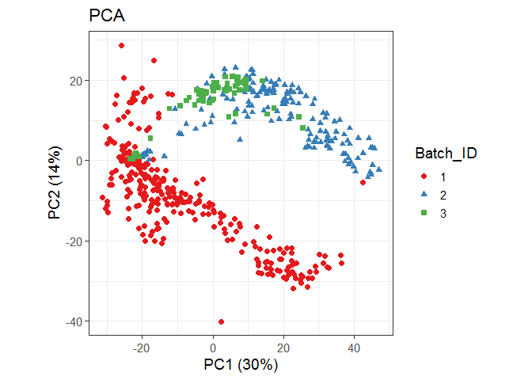
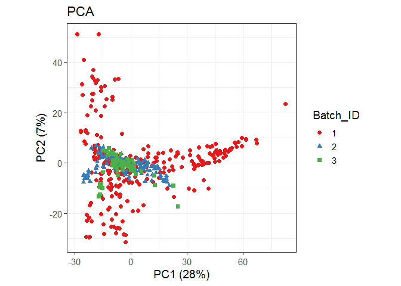

Dengue Virus infection in children: serum metabolomics profiling for
biomarker discovery - Data preprocessing
================
Jefferson Pastuña
2023-03-31

- <a href="#introduction" id="toc-introduction">Introduction</a>
- <a href="#before-to-start" id="toc-before-to-start">Before to start</a>
- <a href="#notame-workflow" id="toc-notame-workflow">Notame workflow</a>
  - <a href="#preprocessing" id="toc-preprocessing">Preprocessing</a>
    - <a href="#detection-rate" id="toc-detection-rate">Detection rate</a>
    - <a href="#drift-correction" id="toc-drift-correction">Drift
      correction</a>
    - <a href="#low-quality-detection" id="toc-low-quality-detection">Low
      quality detection</a>
    - <a href="#flag-contaminant" id="toc-flag-contaminant">Flag
      contaminant</a>
    - <a href="#data-imputation" id="toc-data-imputation">Data imputation</a>
    - <a href="#batch-effect-correction"
      id="toc-batch-effect-correction">Batch effect correction</a>
  - <a href="#data-exportation" id="toc-data-exportation">Data
    exportation</a>

# Introduction

The present notebook aims to record the procedure for data preprocessing
of serum metabolites from children infected with the Dengue Virus. For
each step a brief explanation, the code and graphics obtained are
included.

The workflow used was obtained from [“notame”: Workflow for Non-Targeted
LC–MS Metabolic Profiling](https://doi.org/10.3390/metabo10040135). This
offers a wide variety of functions for performing untargeted metabolic
profile analyses.

# Before to start

The “notame” package accepts as input a feature table that can be
obtained through software such as MZMine, MS-DIAL, among others.

In this case, a feature table was obtained using MS-DIAL. Then, MS–DIAL
(\*. txt) file was slightly modified to obtain the “notame” feature
table format.

Modifications were made to the raw (\*. txt) file can be summarized by
adding and renaming columns. The added columns “Column” and “Ion Mode”
allow the analysis of samples with different types of chromatographic
columns and ionization modes, respectively. In addition, the cells
corresponding to the mass and retention time must be renamed so that the
package can detect and process it.

# Notame workflow

As a first step for the analysis, all the necessary packages were
installed and loaded.

``` r
# Notame package installation
#if (!requireNamespace("devtools", quietly = TRUE)) {
#  install.packages("devtools")
#}
#devtools::install_github("antonvsdata/notame", ref = "v0.3.1")

# Notame library call
library(notame)

# Dependency packages installation
install_dependencies
```

    ## function (preprocessing = TRUE, extra = FALSE, batch_corr = FALSE, 
    ##     misc = FALSE, ...) 
    ## {
    ##     core_cran <- c("BiocManager", "cowplot", "missForest", "openxlsx", 
    ##         "randomForest", "RColorBrewer", "Rtsne")
    ##     core_bioconductor <- "pcaMethods"
    ##     extra_cran <- c("car", "doParallel", "devEMF", "ggbeeswarm", 
    ##         "ggdendro", "ggrepel", "ggtext", "Hmisc", "hexbin", "igraph", 
    ##         "lme4", "lmerTest", "MuMIn", "PERMANOVA", "PK", "rmcorr")
    ##     extra_bioconductor <- c("mixOmics", "supraHex")
    ##     extra_gitlab <- "CarlBrunius/MUVR"
    ##     batch_cran <- "fpc"
    ##     batch_bioconductor <- "RUVSeq"
    ##     batch_github <- NULL
    ##     batch_gitlab <- "CarlBrunius/batchCorr"
    ##     misc_cran <- c("knitr", "rmarkdown", "testthat")
    ##     if (preprocessing) {
    ##         install_helper(cran = core_cran, bioconductor = core_bioconductor, 
    ##             ...)
    ##     }
    ##     if (extra) {
    ##         install_helper(cran = extra_cran, bioconductor = extra_bioconductor, 
    ##             gitlab = extra_gitlab, ...)
    ##     }
    ##     if (batch_corr) {
    ##         install_helper(cran = batch_cran, bioconductor = batch_bioconductor, 
    ##             github = batch_github, gitlab = batch_gitlab, ...)
    ##     }
    ##     if (misc) {
    ##         install_helper(cran = misc_cran, ...)
    ##     }
    ## }
    ## <bytecode: 0x000000000fa5ba08>
    ## <environment: namespace:notame>

Then, a main path (working directory) and a log system was added to have
a record of each process executed.

``` r
# Main path
ppath <- "../Dengue_metabolomics/"
# Log system
init_log(log_file = paste0(ppath, "Result/LCMS_log.txt"))
```

    ## INFO [2024-09-13 13:09:18] Starting logging

Next, the feature list table was imported using the read_from_excel
function.

``` r
data <- read_from_excel(file = "Data/MSDIAL-Feature_height_to_R.xlsx",
                        sheet = 1, corner_row = 5, corner_column = "E", 
                        split_by = c("Column", "Ion Mode"))
```

    ## INFO [2024-09-13 13:11:52] Corner detected correctly at row 5, column E
    ## INFO [2024-09-13 13:11:52] 
    ## Extracting sample information from rows 1 to 5 and columns F to UK
    ## INFO [2024-09-13 13:11:52] Replacing spaces in sample information column names with underscores (_)
    ## INFO [2024-09-13 13:11:52] Naming the last column of sample information "Datafile"
    ## INFO [2024-09-13 13:11:52] 
    ## Extracting feature information from rows 6 to 67941 and columns A to E
    ## INFO [2024-09-13 13:11:52] Creating Split column from Column, Ion Mode
    ## INFO [2024-09-13 13:11:53] Feature_ID column not found, creating feature IDs
    ## INFO [2024-09-13 13:11:53] Identified m/z column Mass and retention time column RT
    ## INFO [2024-09-13 13:11:53] Identified m/z column Mass and retention time column RT
    ## INFO [2024-09-13 13:11:53] Creating feature IDs from Split, m/z and retention time
    ## INFO [2024-09-13 13:11:53] Replacing dots (.) in feature information column names with underscores (_)
    ## INFO [2024-09-13 13:11:53] 
    ## Extracting feature abundances from rows 6 to 67941 and columns F to UK
    ## INFO [2024-09-13 13:11:53] 
    ## Checking sample information
    ## INFO [2024-09-13 13:11:53] QC column generated from rows containing 'QC'
    ## INFO [2024-09-13 13:11:54] Sample ID autogenerated from injection orders and prefix ID_
    ## INFO [2024-09-13 13:11:54] Checking that feature abundances only contain numeric values
    ## INFO [2024-09-13 13:12:25] 
    ## Checking feature information
    ## INFO [2024-09-13 13:12:25] Checking that feature IDs are unique and not stored as numbers
    ## INFO [2024-09-13 13:12:25] Checking that m/z and retention time values are reasonable
    ## INFO [2024-09-13 13:12:25] Identified m/z column Mass and retention time column RT
    ## INFO [2024-09-13 13:12:25] Identified m/z column Mass and retention time column RT

Once the data was read, the next step was to create a MetaboSet in order
to create a specific R object.

``` r
modes <- construct_metabosets(exprs = data$exprs, 
                              pheno_data = data$pheno_data, 
                              feature_data = data$feature_data,
                              group_col = "Group")
```

    ## Initializing the object(s) with unflagged features
    ## INFO [2024-09-13 13:12:25] 
    ## Checking feature information
    ## INFO [2024-09-13 13:12:25] Checking that feature IDs are unique and not stored as numbers
    ## INFO [2024-09-13 13:12:25] Checking that feature abundances only contain numeric values
    ## INFO [2024-09-13 13:12:29] Setting row and column names of exprs based on feature and pheno data

## Preprocessing

Each ionization mode was extracted in a single object (in this case data
had only positive ionization mode). The first step of the preprocessing
is to change the features with value equal to 0 to NA.

``` r
# Data extraction
mode <- modes$RP_POS
# Change 0 value to NA
mode <- mark_nas(mode, value = 0)
```

### Detection rate

In the following line of code, the grouping of chromatographic peaks
with a low detection rate was performed. Where qc_limit filters peaks
not detected in the QCs; for example, a value of 75% with four QCs
indicates that it will keep those chromatographic peaks that are present
in at least three QCs. Similarly, in group_limit, a percentage of 80% in
samples of five repetitions indicates that it will maintain peaks that
are present in at least four of the five repetitions.

``` r
# Low detection rate
mode <- flag_detection(mode, qc_limit = 6/68, group_limit = 2/3)
```

    ## INFO [2024-09-13 13:13:56] 
    ## 68% of features flagged for low detection rate

### Drift correction

The next step is to correct the instability of the equipment signal
during the sample reading (drift effect). Drift effect correction was
performed using QC through cubic spline regression.

``` r
# Drift correction
corrected <- correct_drift(mode)
```

    ## INFO [2024-09-13 13:14:01] 
    ## Starting drift correction at 2024-09-13 13:14:01.819098
    ## INFO [2024-09-13 13:14:02] Values of 1 in feature abundances detected. 1s will be replaced with 1.1.
    ## INFO [2024-09-14 01:31:47] Drift correction performed at 2024-09-14 01:31:47.331941
    ## INFO [2024-09-14 01:33:44] Inspecting drift correction results 2024-09-14 01:33:44.11662
    ## INFO [2024-09-14 07:43:02] Drift correction results inspected at 2024-09-14 07:43:02.129986
    ## INFO [2024-09-14 07:43:02] 
    ## Drift correction results inspected, report:
    ## Drift_corrected: 87%,  Missing_QCS: 13%

### Low quality detection

After drift correction, the low-quality data were grouped into a column
named “Flag.” The flag_quality function uses the internal spread of the
QCs and the spread of the QCs compared with the spread of the biological
samples.

``` r
# Flag low quality features
corrected <- flag_quality(corrected)
```

    ## INFO [2024-09-14 07:43:06] 
    ## 29% of features flagged for low quality

### Flag contaminant

Contaminants have already been removed in MS-DIAL (Sample max/blank
average \> 7 fold change). However, in the dataset the blank is
considered as a sample. To do this, the following line of code removes
process blank group from the dataset.

``` r
# Removal blank group from dataset
corrected <- corrected[, corrected$Group != "Blank"]
```

### Data imputation

Imputation of missing values is then performed using a random forest
algorithm to ensure data reproducibility.

``` r
# Impute missing values using random forest
set.seed(77)
imputed <- impute_rf(corrected)
```

We can inspect the data quality by score PCA plot after data imputation.

``` r
# PCA
imputed_pca <- plot_pca(imputed,
                      center = TRUE,
                      shape = "Batch_ID",
                      color = "Batch_ID")
# Plot
imputed_pca
```

<!-- -->

### Batch effect correction

As you can see in the graph above, the data exhibits batch effect. The
line of code below corrects this batch effect.

``` r
# Drop flagged features to Batch effect correction
no_flag <- drop_flagged(imputed)
# Batch effect correction
corrected_batch <- normalize_batches(no_flag,
                                     batch = "Batch_ID",
                                     group = "QC",
                                     ref_label = "QC")
```

We can inspect the data quality by score PCA plot after Batch effect
correction.

``` r
# PCA
batch_pca <- plot_pca(corrected_batch,
                      center = TRUE,
                      shape = "Batch_ID",
                      color = "Batch_ID")
# Plot
batch_pca
```

<!-- -->

## Data exportation

After preprocessing, high-quality data will be exported for statistical
analysis.

``` r
# Data exportation
write_to_excel(corrected_batch, "Data_to_statistical_analysis.xlsx")
```

Finish a record.

``` r
finish_log()
```

    ## INFO [2024-09-14 08:05:10] Finished analysis. Sat Sep 14 08:05:10 2024
    ## Session info:
    ## 
    ## INFO [2024-09-14 08:05:10] R version 4.4.1 (2024-06-14 ucrt)
    ## INFO [2024-09-14 08:05:10] Platform: x86_64-w64-mingw32/x64
    ## INFO [2024-09-14 08:05:10] Running under: Windows 7 x64 (build 7601) Service Pack 1
    ## INFO [2024-09-14 08:05:10] 
    ## INFO [2024-09-14 08:05:10] Matrix products: default
    ## INFO [2024-09-14 08:05:10] 
    ## INFO [2024-09-14 08:05:10] 
    ## INFO [2024-09-14 08:05:10] locale:
    ## INFO [2024-09-14 08:05:10] [1] LC_COLLATE=English_United States.1252 
    ## INFO [2024-09-14 08:05:10] [2] LC_CTYPE=English_United States.1252   
    ## INFO [2024-09-14 08:05:10] [3] LC_MONETARY=English_United States.1252
    ## INFO [2024-09-14 08:05:10] [4] LC_NUMERIC=C                          
    ## INFO [2024-09-14 08:05:10] [5] LC_TIME=English_United States.1252    
    ## INFO [2024-09-14 08:05:10] 
    ## INFO [2024-09-14 08:05:10] time zone: America/Guayaquil
    ## INFO [2024-09-14 08:05:10] tzcode source: internal
    ## INFO [2024-09-14 08:05:10] 
    ## INFO [2024-09-14 08:05:10] attached base packages:
    ## INFO [2024-09-14 08:05:10] [1] stats     graphics  grDevices utils     datasets  methods   base     
    ## INFO [2024-09-14 08:05:10] 
    ## INFO [2024-09-14 08:05:10] other attached packages:
    ## INFO [2024-09-14 08:05:10] [1] notame_0.3.1        magrittr_2.0.3      ggplot2_3.5.1      
    ## INFO [2024-09-14 08:05:10] [4] futile.logger_1.4.3 Biobase_2.64.0      BiocGenerics_0.50.0
    ## INFO [2024-09-14 08:05:10] 
    ## INFO [2024-09-14 08:05:10] loaded via a namespace (and not attached):
    ## INFO [2024-09-14 08:05:10]  [1] tidyr_1.3.1          utf8_1.2.4           generics_0.1.3      
    ## INFO [2024-09-14 08:05:10]  [4] futile.options_1.0.1 stringi_1.8.4        digest_0.6.36       
    ## INFO [2024-09-14 08:05:10]  [7] evaluate_0.24.0      grid_4.4.1           RColorBrewer_1.1-3  
    ## INFO [2024-09-14 08:05:10] [10] iterators_1.0.14     fastmap_1.2.0        foreach_1.5.2       
    ## INFO [2024-09-14 08:05:10] [13] zip_2.3.1            batchCorr_0.2.5      missForest_1.5      
    ## INFO [2024-09-14 08:05:10] [16] formatR_1.14         doRNG_1.8.6          purrr_1.0.2         
    ## INFO [2024-09-14 08:05:10] [19] fansi_1.0.6          itertools_0.1-3      viridisLite_0.4.2   
    ## INFO [2024-09-14 08:05:10] [22] scales_1.3.0         pcaMethods_1.96.0    codetools_0.2-20    
    ## INFO [2024-09-14 08:05:10] [25] cli_3.6.3            rlang_1.1.4          munsell_0.5.1       
    ## INFO [2024-09-14 08:05:10] [28] withr_3.0.0          yaml_2.3.8           parallel_4.4.1      
    ## INFO [2024-09-14 08:05:10] [31] tools_4.4.1          dplyr_1.1.4          colorspace_2.1-0    
    ## INFO [2024-09-14 08:05:10] [34] rngtools_1.5.2       lambda.r_1.2.4       credentials_2.0.1   
    ## INFO [2024-09-14 08:05:10] [37] vctrs_0.6.5          R6_2.5.1             lifecycle_1.0.4     
    ## INFO [2024-09-14 08:05:10] [40] randomForest_4.7-1.1 fs_1.6.4             usethis_2.2.3       
    ## INFO [2024-09-14 08:05:10] [43] pkgconfig_2.0.3      pillar_1.9.0         openxlsx_4.2.5.2    
    ## INFO [2024-09-14 08:05:10] [46] gtable_0.3.5         glue_1.7.0           Rcpp_1.0.12         
    ## INFO [2024-09-14 08:05:10] [49] highr_0.11           gert_2.0.1           xfun_0.45           
    ## INFO [2024-09-14 08:05:10] [52] tibble_3.2.1         tidyselect_1.2.1     rstudioapi_0.16.0   
    ## INFO [2024-09-14 08:05:10] [55] sys_3.4.2            knitr_1.47           farver_2.1.2        
    ## INFO [2024-09-14 08:05:10] [58] htmltools_0.5.8.1    labeling_0.4.3       rmarkdown_2.27      
    ## INFO [2024-09-14 08:05:10] [61] compiler_4.4.1       askpass_1.2.0        openssl_2.2.0
