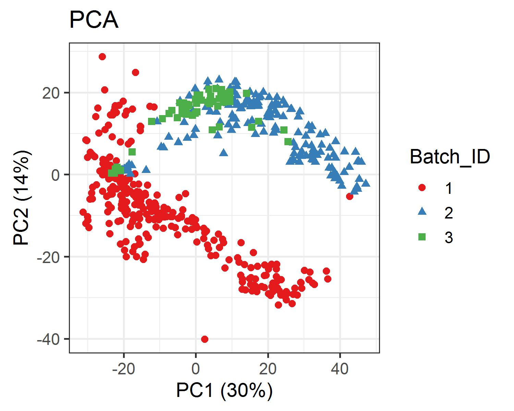
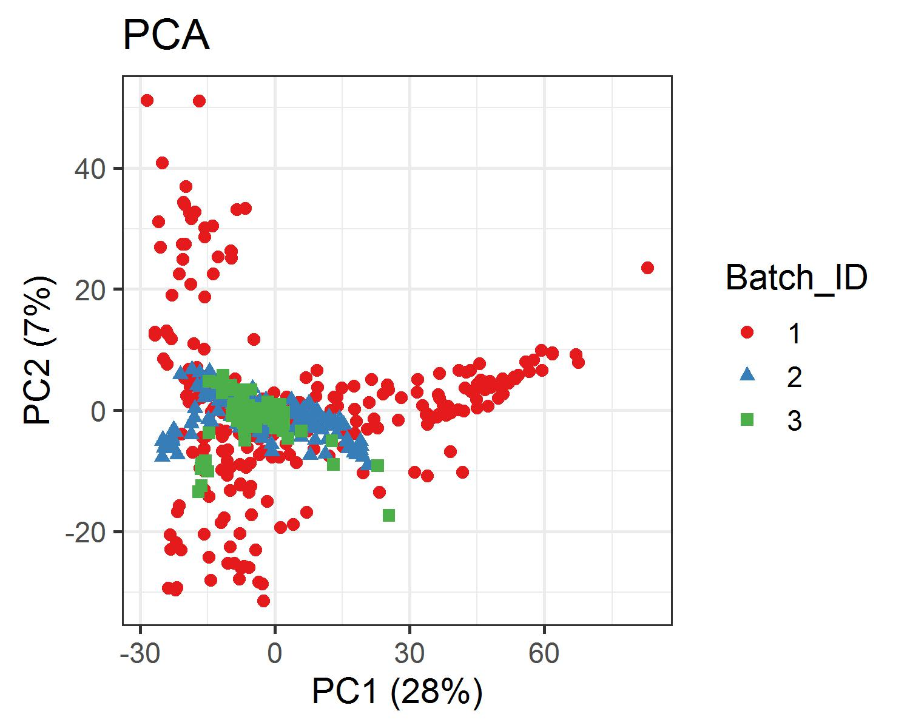

# About this repository

The present document aims to record the procedure given for data preprocessing of 
serum metabolites from children infected with the Dengue Virus. For each step a 
brief explanation, the code and graphics obtained are included.

# Analysis Notebook

- [LC-MS preprocessing workflow](https://github.com/IKIAM-NPLab/Dengue_metabolomics/blob/main/Data_Preprocessing.md)

# Useful results

## PCA of batch correction

- LC-(QTOF) before batch correction

- LC-(QTOF) after batch correction

